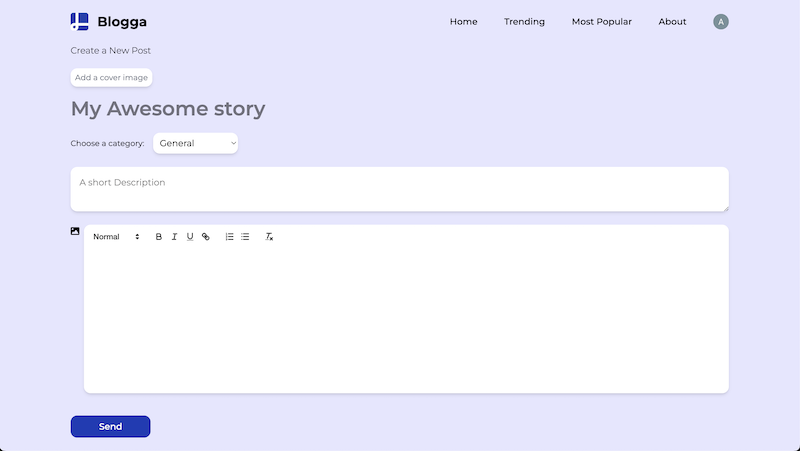

# React Blog App

## 🚀 Demo

---

## 📝 Overview
Welcome to the **React Blog App**! This is a modern, full-stack blogging platform designed for seamless content creation, sharing, and discovery. Built with a focus on performance, security, and user experience, this project demonstrates my skills in both frontend and backend development using the latest technologies.

---

## 🛠️ Tech Stack

### Frontend
- **React** (with Vite for blazing-fast development)
- **TypeScript**
- **React Router** (client-side routing)
- **Tailwind CSS** (utility-first styling)
- **ImageKit** (image uploads and optimization)

### Backend
- **Node.js** & **Express.js**
- **MongoDB** (with Mongoose ODM)
- **Redis** (caching & rate-limiting)
- **Clerk** (authentication & user management)
- **Helmet** (security headers)
- **Compression** (response compression)
- **CORS** (cross-origin resource sharing)

---

## 📦 Key Libraries & Packages
- `express-rate-limit` & `rate-limit-redis` (API rate limiting)
- `react-infinite-scroll-component` (Infinite scrolling)
- `react-quill-new` (Text Editor)
- `mongoose` (MongoDB modeling)
- `@clerk/express` (authentication middleware)
- `imagekit` (media management)
- `compression`, `helmet`, `cors` (Express middleware)
- `winston` (Logging library)

---

## ✨ Features
- User authentication & authorization
- Create, edit, and delete blog posts
- Rich text editing & image uploads
- Search, filter, and sort posts
- Caching and rate-limiting for performance & security
- Responsive, modern UI

---

## 📸 Screenshots

---

## 📚 Getting Started
1. Clone the repo
2. Install dependencies: `npm install`
3. Set up your `.env` file (see `.env.example`)
4. Start the development server: `npm run dev`

---

## 🤝 Connect
If you like this project or want to collaborate, feel free to reach out!

---

> _Thank you for checking out my project!_
